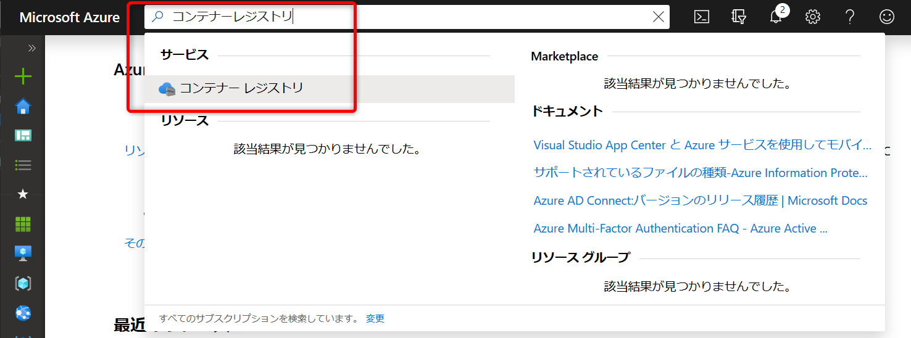
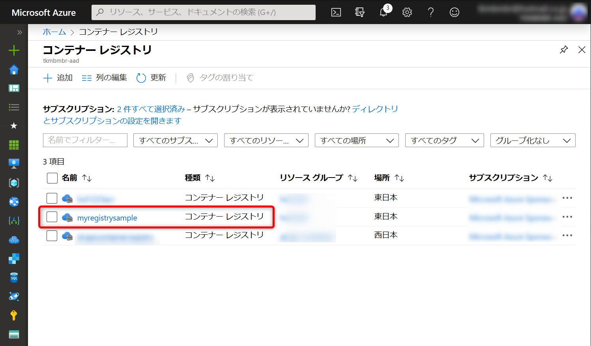
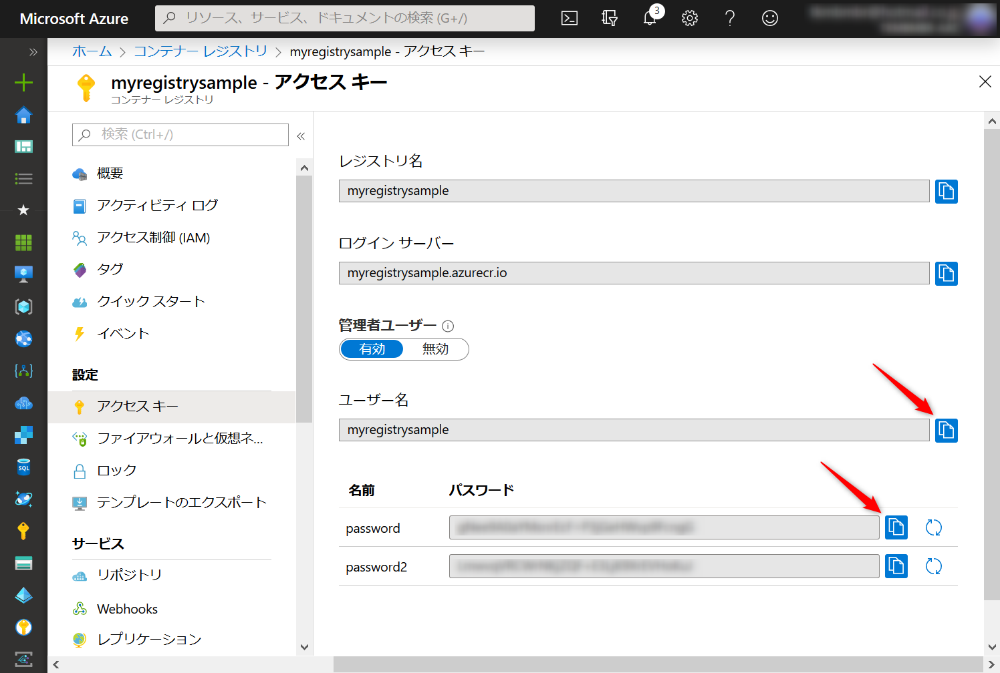
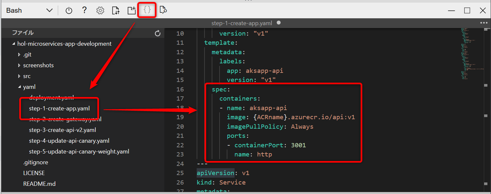
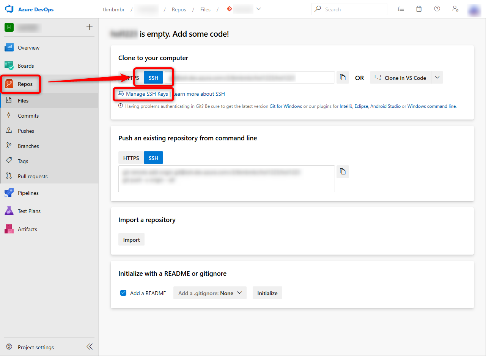
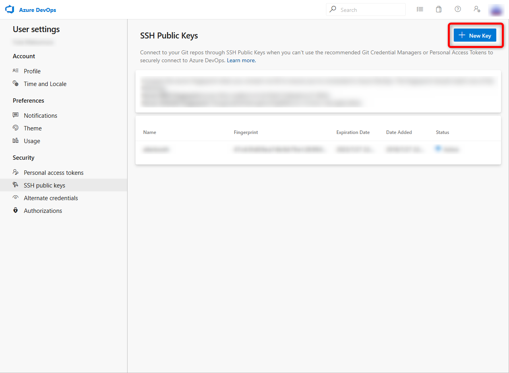
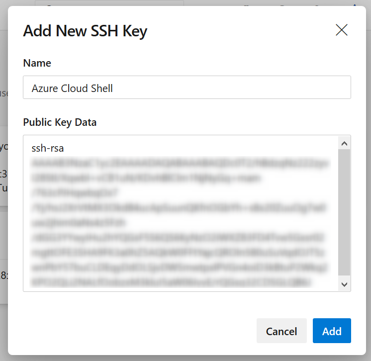

# hol-microservices-app-development
マイクロサービスアプリケーション開発講座

# マイクロサービスアプリケーション開発　ハンズオン
## 事前作業
* Microsoft Azureサブスクリプションの取得
* Visual Studio Codeインストール
* Dockerインストール
* Gitインストール
* Node.jsインストール

## 利用するプロダクトのバージョン
* Kubernetes(AKS) : 1.12.8
* Istio : 1.2.0
* Jeager : 1.8
* Node.js : 10.16.0 LTS

## 本ドキュメントの構成


## 文中のyamlについて
本リポジトリ内のyamlディレクトリに同一ファイル名称で格納していますのでご参照ください。    

## コマンド入力の表記について
$ と記載しているものはローカルPC環境で、  
xxxx@Azure:~$ と記載しているものはAzure Cloud Shellで実行します。

## 1. 環境構築
### 1-1. Azure Kubernetes Service(AKS)の構築
[Azure Portal](https://portal.azure.com/)へログインします。  
まず始めにAzure PortalよりCloud Shellを起動します。  
リソースグループを作成し、作成したリソースグループへAKSを構築します。  
```
xxxx@Azure:~$ az group create --name {ResourceGroup} --location japaneast
xxxx@Azure:~$ az aks create \
                  --resource-group {ResourceGroup} \
                  --name {AKSname} \
                  --node-count 2 \
                  --enable-addons monitoring \
                  --generate-ssh-keys
```

### 1-2. Azure Container Registry(ACR)の構築
後述するアプリケーションのコンテナレジストリとしてACRを構築します。  
```
xxxx@Azure:~$ az acr create --resource-group {ResourceGroup} --name {ACRname} --sku Basic --admin-enabled true
```
また、AKSクラスターへのアクセス許可を以下のシェルスクリプトで付与します。
```
#!/bin/bash

AKS_RESOURCE_GROUP={ResourceGroup}
AKS_CLUSTER_NAME={AKSname}
ACR_RESOURCE_GROUP={ResourceGroup}
ACR_NAME={ACRname}

# Get the id of the service principal configured for AKS
CLIENT_ID=$(az aks show --resource-group $AKS_RESOURCE_GROUP --name $AKS_CLUSTER_NAME --query "servicePrincipalProfile.clientId" --output tsv)

# Get the ACR registry resource id
ACR_ID=$(az acr show --name $ACR_NAME --resource-group $ACR_RESOURCE_GROUP --query "id" --output tsv)

# Create role assignment
az role assignment create --assignee $CLIENT_ID --role acrpull --scope $ACR_ID
```

### 1-3. サービスメッシュ実装  
サービスメッシュを実現するために、Istioを実装します。  
まず始めにAzure PortalよりCloud Shellを起動します。  
「Bash」を選択し、Create storageをクリックします。  
以下コマンドを投入し、クレデンシャル情報を取得します。  
Istioをインストールします。
```
xxxx@Azure:~$ az aks get-credentials -g {ResourceGroup} -n {AKSname}
xxxx@Azure:~$ curl -L https://git.io/getLatestIstio | ISTIO_VERSION=1.2.0 sh -
xxxx@Azure:~$ cd istio-1.2.0
xxxx@Azure:~$ export PATH=$PWD/bin:$PATH
xxxx@Azure:~$ for i in install/kubernetes/helm/istio-init/files/crd*yaml; do kubectl apply -f $i; done
xxxx@Azure:~$ kubectl apply -f install/kubernetes/istio-demo.yaml
```
※項1で構築したAKSのResource GroupとResouce Nameを使用します。

Istioのインストール確認をします。
```
xxxx@Azure:~$ kubectl get po -n istio-system
NAME                                      READY   STATUS      RESTARTS   AGE
grafana-77b49c55db-bdbs2                  1/1     Running     0          23m
istio-citadel-66d49b64fc-9jw2z            1/1     Running     0          23m
istio-cleanup-secrets-1.2.0-vrtqh         0/1     Completed   0          23m
istio-egressgateway-68d9cfdd4-z7nsv       1/1     Running     0          23m
istio-galley-676599ffb4-jxprm             1/1     Running     0          23m
istio-grafana-post-install-1.2.0-jrwjx    0/1     Completed   0          23m
istio-ingressgateway-7fbf7bcf45-clwrp     1/1     Running     0          23m
istio-pilot-56b4dd7bd7-fpdqn              2/2     Running     0          23m
istio-policy-7bcc6d45df-ssdzv             2/2     Running     2          23m
istio-security-post-install-1.2.0-sc95j   0/1     Completed   0          23m
istio-sidecar-injector-779544894b-8tvj8   1/1     Running     0          23m
istio-telemetry-d6f5cd5d9-2759p           2/2     Running     3          23m
istio-tracing-595796cf54-vv2bv            1/1     Running     0          23m
kiali-5c584d45f6-h6nn7                    1/1     Running     0          23m
prometheus-5fffdf8848-gwrbg               1/1     Running     0          23m
```

### 1-4. 分散トレーシング
分散トレーシングを実現するために、Jaegerを実装します。
```
xxxx@Azure:~$ kubectl apply -n istio-system -f https://raw.githubusercontent.com/jaegertracing/jaeger-kubernetes/master/all-in-one/jaeger-all-in-one-template.yml
```

コンソールへのアクセスURLは以下コマンドでIPアドレスを参照し、ブラウザでアクセスします。
```
xxxx@Azure:~$ kubectl get service jaeger-query -n istio-system
NAME           TYPE           CLUSTER-IP    EXTERNAL-IP     PORT(S)        AGE
jaeger-query   LoadBalancer   10.0.0.0   xxx.xxx.xxx.xxx   80:31742/TCP   111s
```
アプリケーションへの実装は後述します。

### 1-5. 構成ファイルのダウンロード
Cloud Shellで以下のコマンドを入力し、ハンズオンで使用する構成ファイルをダウンロードします。
```
xxxx@Azure:~$ git clone https://github.com/alterbooth/hol-microservices-app-development.git
```

## 2. アプリケーション開発
### 2-1. サンプルアプリケーションのダウンロード
下記URLにアクセスし、サンプルアプリケーションのZipファイルをダウンロードします。  
https://github.com/alterbooth/hol-microservices-app-development/archive/master.zip

ダウンロードが完了したらZipファイルを展開します。

### 2-2. アプリケーションのコンテナ化
前項でダウンロードしたアプリケーションをコンテナ化します。  
[web]
```
$ cd src/web
$ docker build ./ -t web
```
[api]
```
$ cd src/api
$ docker build ./ -t api
```

次にACRへコンテナイメージをプッシュします。  
以下を参考にAzure PortalでContainer Registry > Access keysよりLogin serverとUsername/passwordを確認します。

  
  
  

作成したコンテナイメージのタグをACRへプッシュするため変更し、ACRへログインしてプッシュします。  
`docker login`のコマンドを実行した際に、コンテナレジストリのUsername/passwordの入力を求められます。

```
$ docker tag web {ACRname}.azurecr.io/web:v1
$ docker tag api {ACRname}.azurecr.io/api:v1
$ docker login {ACRname}.azurecr.io
$ docker push {ACRname}.azurecr.io/web:v1
$ docker push {ACRname}.azurecr.io/api:v1
```

### 2-3. kubernetes Deploymentの作成
アプリケーションをデプロイするnamespaceを準備します。  
また、追加したnamespaceで全てのPodにIstioプロキシをサイドカーとして挿入するようにします。
```
xxxx@Azure:~$ kubectl create namespace aksapp
xxxx@Azure:~$ kubectl label namespace aksapp istio-injection=enabled
```

Kubernetesで動作させるためにyamlを作成します。  
Cloud Shellでエディタを起動します。  


step-1-create-app.yamlのimage部分を作成したACRへ編集します。
```
    spec:
      containers:
      - name: aksapp-web
        image: {ACRname}.azurecr.io/web:v1
        imagePullPolicy: Always
        ports:
        - containerPort: 3000
          name: http
```
```
    spec:
      containers:
      - name: aksapp-api
        image: {ACRname}.azurecr.io/api:v1
        imagePullPolicy: Always
        ports:
        - containerPort: 3001
          name: http
```

作成したstep-1-create-app.yamlを使ってKubernetesへコンテナアプリケーションをデプロイします。
```
xxxx@Azure:~$ kubectl apply -f step-1-create-app.yaml -n aksapp
```

VirtualServiceとGatewayを作成するため、step-2-create-gateway.yamlを作成してデプロイします。
```
xxxx@Azure:~$ kubectl apply -f step-2-create-gateway.yaml -n aksapp
```

確認するには以下のコマンドを入力します。
```
xxxx@Azure:~$ kubectl get deploy,po,service,gateway,virtualservice -n aksapp
NAME                                   DESIRED   CURRENT   UP-TO-DATE   AVAILABLE   AGE
deployment.extensions/aksapp-api-1-0   2         2         2            2           117s
deployment.extensions/aksapp-web-1-0   2         2         2            2           117s

NAME                                  READY   STATUS    RESTARTS   AGE
pod/aksapp-api-1-0-7b7f478986-nrsnj   2/2     Running   0          30s
pod/aksapp-api-1-0-7b7f478986-qgcmq   2/2     Running   0          117s
pod/aksapp-web-1-0-6d664dcd56-7hrxn   2/2     Running   0          117s
pod/aksapp-web-1-0-6d664dcd56-wr9hz   2/2     Running   0          117s

NAME                 TYPE        CLUSTER-IP     EXTERNAL-IP   PORT(S)    AGE
service/aksapp-api   ClusterIP   10.0.xxx.xxx   <none>        3001/TCP   117s
service/aksapp-web   ClusterIP   10.0.xxx.xxx   <none>        3000/TCP   117s

NAME                                             AGE
gateway.networking.istio.io/aksapp-web-gateway   1m

NAME                                            GATEWAYS               HOSTS   AGE
virtualservice.networking.istio.io/aksapp-web   [aksapp-web-gateway]   [*]     1m
```

アプリケーションへアクセスするためのIPアドレスは以下コマンドで調べられます。
```
xxxx@Azure:~$ kubectl get service istio-ingressgateway --namespace istio-system -o jsonpath='{.status.loadBalancer.ingress[0].ip}'
xxx.xxx.xxx.xxx
```
表示されたIPアドレスでアプリケーションが表示されるか確認します。


## 2-4. カナリアリリースの実装
先ほど作ったアプリケーションを変更し、異なるバージョンを作成します。  
src/api/index.jsを編集し、ACRへバージョンタグをv2としてプッシュします。
```
$ docker build ./ -t api
$ docker tag api {ACR Login server}/api:v2
$ docker push {ACR Login server}/api:v2
```

Cloud Shellでstep-3-create-api-v2.yamlのimage部分を作成したACRへ編集します。
```
    spec:
      containers:
      - name: aksapp-api
        image: {ACRname}.azurecr.io/api:v2
        imagePullPolicy: Always
        ports:
        - containerPort: 3001
          name: http
```

新しいバージョンのアプリケーションをデプロイします。
```
xxxx@Azure:~$ kubectl apply -f step-3-create-api-v2.yaml -n aksapp
```

動作を確認します。  
現状ではapi:v1とapi:v2が均等にロードバランスされていることがわかります。


2つのバージョンの表示割合を変更するため、VirtualServiceを変更します。  
ここではv1を80%、v2を20%の割合で表示します。
```
xxxx@Azure:~$ kubectl apply -f step-4-update-api-canary.yaml -n aksapp
```

比率指定はweightで行います。
```
    - destination:
        host: aksapp-api.aksapp.svc.cluster.local
        subset: v1-0
        port:
          number: 3001
      weight: 80
    - destination:
        host: aksapp-api.aksapp.svc.cluster.local
        subset: v2-0
        port:
          number: 3001
      weight: 20
```
api:v1とapi:v2が8:2の割合で表示されることをブラウザ等で確認します。  
  
次にv2へ完全移行します。  
weightの値をv1を0、v2を100にします。
```
    - destination:
        host: aksapp-api.aksapp.svc.cluster.local
        subset: v1-0
        port:
          number: 3001
      weight: 0
    - destination:
        host: aksapp-api.aksapp.svc.cluster.local
        subset: v2-0
        port:
          number: 3001
      weight: 100
```

変更したらデプロイします。
```
xxxx@Azure:~$ kubectl apply -f step-5-update-api-canary-weight.yaml -n aksapp
```

v2のみ表示されることを確認します。


### 2-5. 分散トレーシングの確認
これまでのアプリケーションの動作確認でトレースログが取れているので、JaegerのUIより確認します。  
以下コマンドにてアクセスするIPアドレスを確認します。
```
xxxx@Azure:~$ kubectl get service jaeger-query -n istio-system
NAME           TYPE           CLUSTER-IP    EXTERNAL-IP     PORT(S)        AGE
jaeger-query   LoadBalancer   10.0.0.0   xxx.xxx.xxx.xxx   80:31742/TCP   111s
```

取得できたIPアドレスをブラウザで表示します。  
以下のような画面が出るので、Serviceからaksapp-web.aksappを選択してFind Tracesをクリックします。  

  
アクセスしたログが表示されるので、その内の一つをクリックすると詳細が表示されます。  


## 3. パイプラインの作成
前項までに作成したアプリケーションのCI/CDパイプライン実装を行います。  
### 3-1. プロジェクトの作成
[Azure DevOps](https://dev.azure.com/)へサインインします。  

Project nameを入力し、Create projectをクリックします。  

### 3-2. リポジトリの作成
Reposに対してsshでコードをプッシュするため、SSH public keyを登録します。  
AKS作成時に生成されたキーがあるのでCloud Shellで`~/.ssh/id_rsa.pub`の内容をコピーしておきます。  
下記のようにAzure DevOpsのユーザーのSecurity→SSH public keysへ登録します。

  
  
  

Reposを開き、リポジトリのURLを取得して[2](#-2.-アプリケーション開発)で作成したアプリケーションのディレクトリにて以下コマンドを入力してリモートリポジトリを登録します。  
対象はapiとします。  
また、Kubernetesへデプロイするためのyamlも用意します。  
api/deployment.yamlという名称でファイルを作り、プッシュします。  
サンプルのdeployment.yamlの{ACRname}は置き換えてください。
```
xxxx@Azure:~$ cd api
xxxx@Azure:~$ git init
xxxx@Azure:~$ git config --global user.name "User Name"
xxxx@Azure:~$ git config --global user.email {e-mail}
xxxx@Azure:~$ git add .
xxxx@Azure:~$ git commit -m "First commit"
xxxx@Azure:~$ git remote add origin git@ssh.dev.azure.com:v3/xxxxx/xxxxx/xxxxx
xxxx@Azure:~$ git push origin master
```

### 3-3. ビルドの作成
Pipelinesを開き、New pipelineをクリックします。  
Use the classic editorをクリックし、Azure Repos Gitにて先ほどプッシュしたリポジトリが選択されていることを確認し、Continueをクリックします。  
Docker containerをApplyします。  
Variablesを開き、Addでdockercontainerを作成し、Valueにはapiと入力します。  
Triggersを開き、Enable contrinuous integrationへチェックを入れ、TypeにInclude、Branch specificationにmasterを選択します。  
Tasksを開き、Build an imageとPush an imageにて[3-2](#1-2-azure-container-registryacrの構築)で作成したレジストリをそれぞれAzure subscriptionとAzure container Registryにて選択します。  
Azure subscriptionを選択した際には右側のAuthorizeボタンをクリックします。  
また、Image Nameには$(dockercontainer):$(Build.BuildNumber)と入力します。  
+をクリックし、Push an imageの下にBashをAddします。  
TypeをInlineにしてScriptを以下のようにします。
```
# Write your commands here

sed -i -e s/latest/$(Build.BuildNumber)/g $(Build.SourcesDirectory)/deployment.yaml

cat $(Build.SourcesDirectory)/deployment.yaml

# Use the environment variables input below to pass secret variables to this script
```
Publish Build Artifactを追加し、deployment.yamlを選択します。  
Path to publishでdeployment.yamlを選択、Artifact nameではyamlと入力し、Save & Queueします。  


Buildが実行されますので動作を確認します。  


### 3-4. リリースの作成
Releasesを開き、New pipelineをクリックします。  
Deploy to a Kubernetes clusterをApplyします。  
Stageは×で閉じ、Add an artifactをクリックし、[3-3](#3-3-ビルドの作成)で作成したBuildをSourceに選んでAddします。  
右上の丸雷アイコンをクリックし、Continuous deployment triggerをEnabledにします。  
Build branch filtersをAddしてBuild branchをmasterにします。  
Stage 1の下にある「1 job, 1task」をクリックし、kubectlを選択します。  
Kubernets service connectionは+Newをクリックし、Azure Subscriptionから対象のAKSクラスタを選択します。 
Namespaceにはaksappを選択します。  
Connection nameには任意の名称を入力します。  
画面が戻るのでNamespaceにaksappを入力し、Commandはapplyを選択してUse Configuration filesにチェックを入れてdeployment.yamlを選択します。  
SaveしてOKします。  
  


動作確認の為、Create releaseをクリックします。  

### 3-5. パイプラインの実行
[3-3](#-3-2.-リポジトリの作成)で作成したReposのmasterを更新することでパイプラインが実行されます。  
動作するかの確認のため、apiアプリを更新します。  
index.jsの以下文面を変更します。  
```
message: 'Hello World v1'
```
変更したらリポジトリへプッシュします。
```
xxxx@Azure:~$ git add .
xxxx@Azure:~$ git commit -m "modified index.js"
xxxx@Azure:~$ git push origin master
```
Azure DevOpsの画面にて動作したかの確認をします。


## 4. リソースの削除
### 4-1. Kubernetesリソースの削除
対象のnamespaceを削除することで使用したアプリをAKSクラスターから削除できます。
```
xxxx@Azure:~$ kubectl delete namespace aksapp
```

### 4-2. Azure リソースの削除
[Azure Portal](https://portal.azure.com/)より1-1で作成したリソースグループを削除します。  
```
xxxx@Azure:~$ az group delete --name {ResourceGroup}
```

### 4-3. Azure DevOpsリソースの削除
[Azure DevOps](https://dev.azure.com/)より3-2で作成したプロジェクトを削除します。

